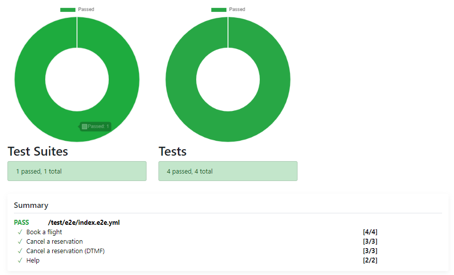
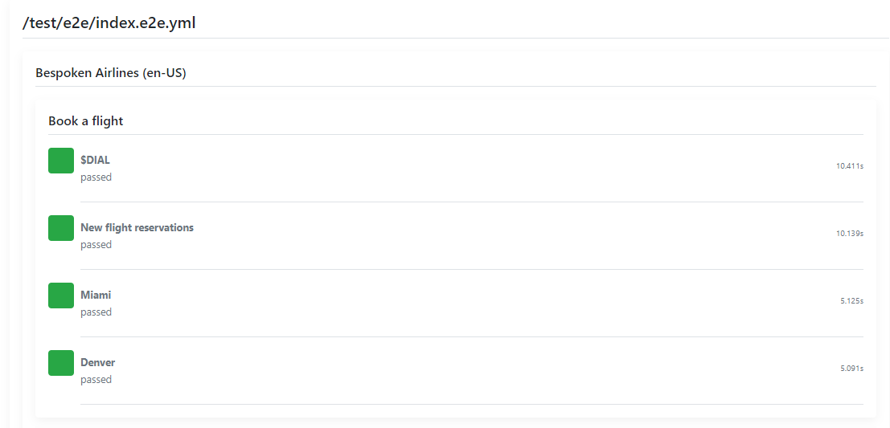
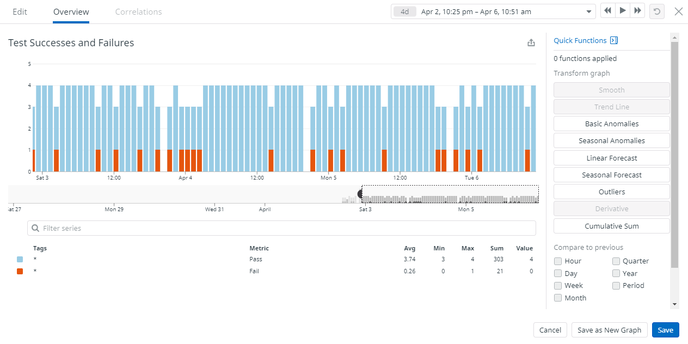

# Bespoken Airlines for AWS Connect
This project demonstrates a set of tests setup to run against our AWS Connect-based voice application.

## Setup
Create a Virtual Device Token following these instructions:  
https://read.bespoken.io/end-to-end/ivr/

Once you have a Virtual Device Token of your own, set it here:  
https://github.com/bespoken-samples/bespoken-airlines-connect/blob/main/testing.json#L2

Alternatively, you can set it as a Github secret and then load it as an environment variable:  
https://docs.github.com/en/actions/reference/encrypted-secrets#using-encrypted-secrets-in-a-workflow

## Running The Tests
To run the tests manually:
* Go to the [e2e workflow page](https://github.com/bespoken-samples/bespoken-airlines-connect/actions/workflows/e2e.yml)
* Click "Run Workflow"

That's all there is to it!

## Viewing The Results
The main output from the tests is an HTML report. It can be found as a part of each Github workflow that has been run:  
https://github.com/bespoken-samples/bespoken-airlines-connect/actions/runs/706573143

The report summarizes the results of each test:

 
For each individual test, we can review each step that occurred:

Additionally, we have integrated with DataDog, where we can view our test results over time:  

## Learn More
Check out our blog post on the AWS Developer site to learn more about this project:
COMING SOON!
